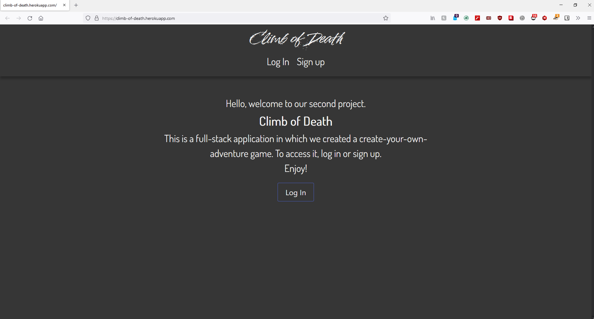
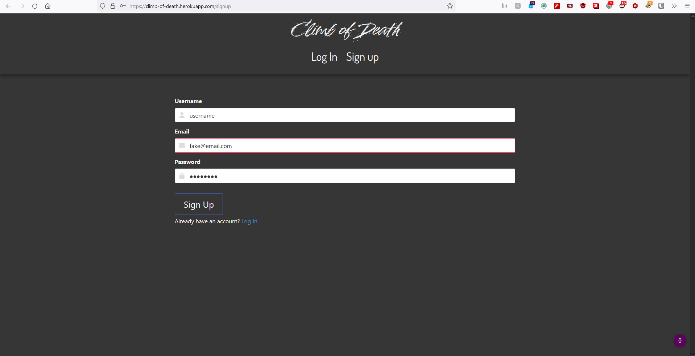
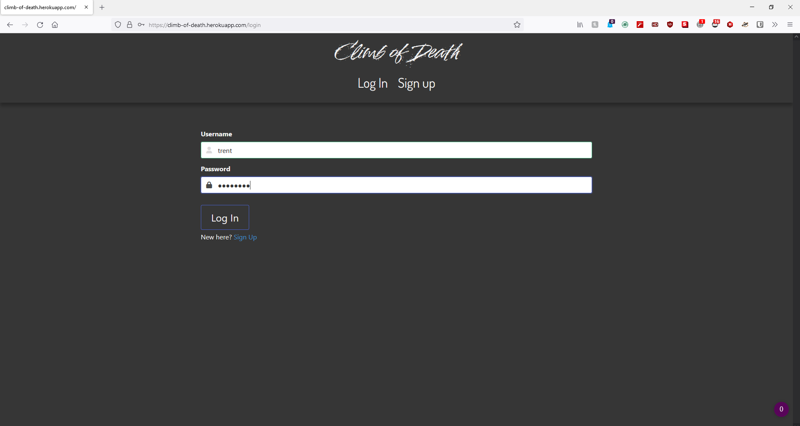
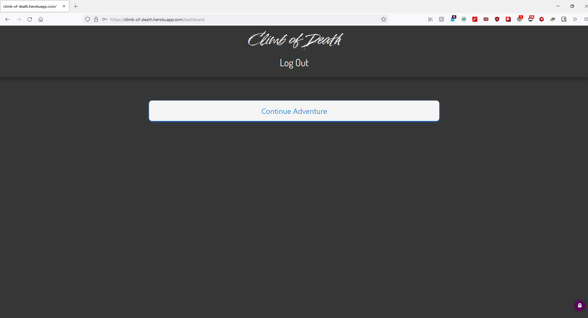
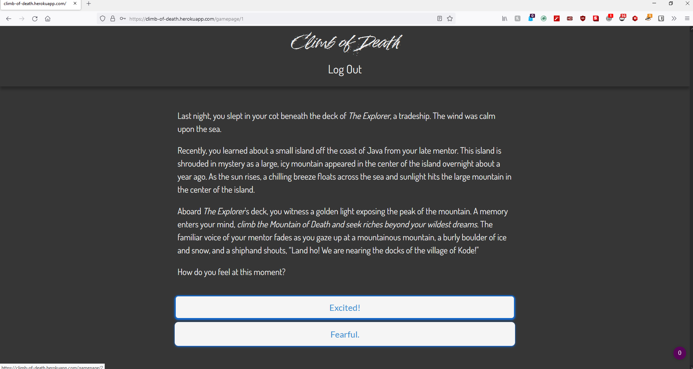
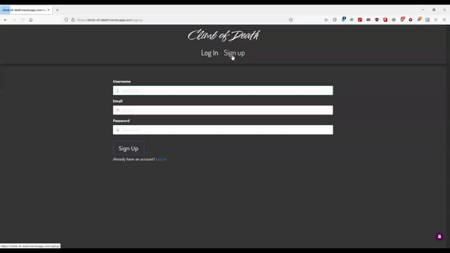

# Climb of Death

 

## Description

Welcome to the *Climb of Death*, a choose your own adventure game. This full-stack web application crosses novel reading with user interaction. As a user, you get to choose your own unique storyline!

This application is deployed to Heroku, **[click here](https://climb-of-death.herokuapp.com/)**.

This application has a GitHub repository, **[click here](https://github.com/RichardZhang01/climb-of-death)**.

## Table of Contents

1. [Features & Tech](#features-and-tech)
2. [Installation](#installation)
3. [Usage](#usage)
4. [Demonstration](#demonstration)
5. [Tests](#tests)
6. [How to Contribute](#how-to-contribute)
7. [Questions?](#questions)
8. [Credits](#credits)
9. [License](#license)

## Features and Technologies

>     Bcrypt
>     Bulma
>     CSS
>     Dotenv
>     Express
>     Handlebars
>     Heroku
>     HTML
>     JavaScript
>     JawsDB
>     Mobile-first design
>     Model-view-controller
>     MySQL
>     Node
>     Nodemon
>     Sequelize
>     Session

## Installation

This application is deployed to Heroku, **[click here](https://climb-of-death.herokuapp.com/)**.

If you want to download this project:

  >     Open a command-line interface or terminal, such as Command Prompt, Git Bash, Powershell, Terminal
  >>     Make a directory/folder
  >>     Enter the directory/folder
  >>     Clone the repository
  >     git clone https://github.com/RichardZhang01/climb-of-death.git 
  >>     If the GitHub repository has been updated since you last visited then...
  >     git pull

## Usage

This application is deployed to Heroku, **[click here](https://climb-of-death.herokuapp.com/)**.

Upon loading the landing page, the user is given a choice to sign up or login to *Climb of Death*. The user must login in order to play *Climb of Death*. Once logged in, the user will be directed to the adventure start. 

The user must click buttons to start and play the adventure. A block of text will provide content for your scenario. 

Beneath the scenario, the user will have one or many buttons representing choices. Upon clicking a choice, the user will be brought into a new scenario with new choices.

As the user makes more choices the story will develop and feel unique to the user as their choices affect the decision tree and the story pathway.

If the user wishes to end their session, then they can log out or close the browser or browser tab.

Upon logging back in, the user will start on the page they left. 

##  Demonstration

This application is deployed to Heroku, **[click here](https://climb-of-death.herokuapp.com/).**

Screenshots:

 

Gifs:

## Tests

Thank you to all our friends and family who tested our deployed application!

The deployed application has been beta tested on multiple devices (mobile and desktop) and browsers: 
>Brave 
>>Chrome
>>>Microsoft Edge
>>>>Mozilla Firefox
>>>>>Safari

## How to Contribute

Reach out to us if you would like to contribute to this application!

Send an email with the subject "RE: Climb of Death - CYOA"

To: Trent @ trentdickson22@gmail.com

## Questions?

Are you interested in how to create your own "Choose Your Own Adventure"? 

Did a part of our project catch your interest and you would like more information on how to do it yourself?

Reach out to our development trio here: trentdickson22@gmail.com

## Credits

Richard Zhang: [GitHub](https://github.com/RichardZhang01)

Sachmilan Singh: [GitHub](https://github.com/sachmilan)

Trent Dickson: [GitHub](https://github.com/tdickson96) & [LinkedIn](https://www.linkedin.com/in/tad96/) 

## License

This application is covered under the [MIT](https://opensource.org/licenses/MIT) license

----------------------------------------------------------------

  Copyright © 2022 Sachmilan Gangarh, Trent Dickson, and Richard Zhang

  Permission is hereby granted, free of charge, to any person obtaining a copy of this software and associated documentation files (the "Software"), to deal in the Software without restriction, including without limitation the rights to use, copy, modify, merge, publish, distribute, sublicense, and/or sell copies of the Software, and to permit persons to whom the Software is furnished to do so, subject to the following conditions:
  
  The above copyright notice and this permission notice shall be included in all copies or substantial portions of the Software.
  
  THE SOFTWARE IS PROVIDED "AS IS", WITHOUT WARRANTY OF ANY KIND, EXPRESS OR IMPLIED, INCLUDING BUT NOT LIMITED TO THE WARRANTIES OF MERCHANTABILITY, FITNESS FOR A PARTICULAR PURPOSE AND NONINFRINGEMENT. IN NO EVENT SHALL THE AUTHORS OR COPYRIGHT HOLDERS BE LIABLE FOR ANY CLAIM, DAMAGES OR OTHER LIABILITY, WHETHER IN AN ACTION OF CONTRACT, TORT OR OTHERWISE, ARISING FROM, OUT OF OR IN CONNECTION WITH THE SOFTWARE OR THE USE OR OTHER DEALINGS IN THE SOFTWARE.

-----------------------------------------------------------------
